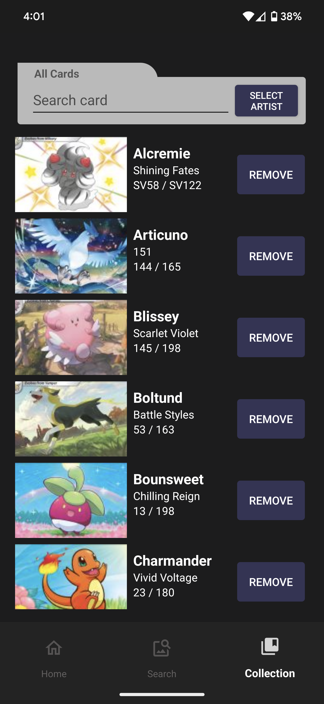
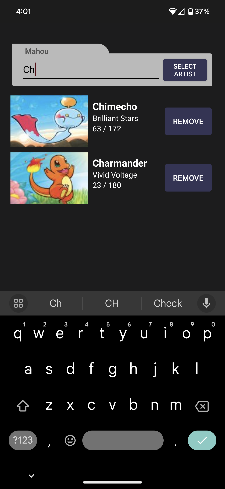

# Collectomon App

<table>
  <tr>
    <td width="700dp">
      Welcome to Collectomon, the innovative app for Android users designed to manage, collect, and explore Pokémon cards by artists! Whether you're an avid collector or just starting, Collectomon offers an easy-to-use interface to catalog your cards, discover new ones, and keep track of your growing collection. Dive into a meticulously organised world where every       Pokémon card is at your fingertips!
    </td>
    <td>
      
    </td>
  </tr>
</table>

## Features

- **Artist-Driven Collection**: Easily add artists from a dropdown menu or manually to start collecting cards associated with them.
- **Comprehensive Search**: Look up cards by artist, and find a card directly through the search bar, complete with card images, names, and numbers.
- **Personal Collection Management**: Add cards to your collection with a simple tap and view your collected cards sorted by artist or see all cards in your database.
- **Backup and Restore**: Secure your collection with backup options and restore them if you made a mistake.
- **Interactive Card Display**: View detailed information about each card and manage your collection with ease.

## Screenshots

Experience Collectomon in action! Here's a sneak peek at what you can expect:

**Home Screen - Add artists and manage your collection.**

  
  
  

**Search Screen - Discover and add new cards to your collection.**

  
  

**Collection Screen - View and manage your collected cards.**

  
  
  

## Getting Started

### Installation

1. Visit the Google Play Store and search for "Collectomon." [https://play.google.com/store/apps/details?id=com.indyus.collectomon]
2. Download and install the app onto your Android device.
3. Open the app to get started with your collection.

### Requirements

- Android 9.0 or higher.
- Active internet connection for downloading card images and data updates.

## Usage

### Home Screen

- **Add Artists**: Use the dropdown or manual entry to add artists whose Pokémon cards you want to collect.
- **Backup and Restore**: Ensure your collection is safe with easy backup options and restore functionality.

### Search Screen

- **Search and View Cards**: Select an artist to view all Pokémon cards they've designed, or use the search bar for specific card inquiries.
- **Add to Collection**: Add cards to your collection directly from the search results with a simple "Add" button.

### Collection Screen

- **Manage Your Collection**: View cards you've collected by artist or see all cards in your collection.
- **Remove Cards**: Easily remove cards from your collection as needed.

## Support

Encounter an issue or have a suggestion? We value your feedback:

- **Contact Us - FAQs and Troubleshooting**: [indyshivy@gmail.com]

## Updates

Keep your app updated for the latest features and an ever-improving experience. Follow us on the Google Play Store and enable updates for Collectomon.

## Credits

Collectomon is proudly developed by me (Indy) and published by IndyInc. Special thanks to all the Pokémon artists and the community of collectors.

## Copyright and Acknowledgements

All Pokémon content, including images, names, and related data, are copyright and trademarks of their respective owners, including Nintendo, Game Freak, Serebii, and individual artists. 
Collectomon is not affiliated with these entities and claims no ownership over any Pokémon content. This application is intended for educational and informational purposes to foster community and fan engagement. 
All copyrights and trademarks are acknowledged and respected. Special thanks to Serebii.net for the collation of information.

Thank you for choosing Collectomon as your preferred Pokémon card collecting companion!

